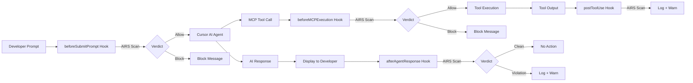

# Prisma AIRS Cursor Hooks

**Real-time AI security scanning for the Cursor IDE**

[](https://www.npmjs.com/package/@cdot65/prisma-airs-cursor-hooks)
[](https://github.com/cdot65/prisma-airs-cursor-hooks/actions/workflows/ci.yml)
[](https://opensource.org/licenses/MIT)
[](https://nodejs.org/)

---

Prisma AIRS Cursor Hooks scans prompts, tool activity, file reads, and AI responses in the Cursor IDE in real-time via the [Prisma AI Runtime Security (AIRS)](https://www.paloaltonetworks.com/prisma/ai-runtime-security) Sync API. **Blocks** prompts, MCP tool calls — and optionally shell commands, file reads, and subagent spawns — before they execute, and **audits** AI responses and tool outputs for prompt injections, malicious code, sensitive data leakage, toxic content, and policy violations.

---

## Install

```bash
npm install -g @cdot65/prisma-airs-cursor-hooks
```

---

## How It Works



:::warning[postToolUse and afterAgentResponse are observe-only]
`postToolUse` and `afterAgentResponse` fire **after** content is already processed or displayed. They cannot block or retract content — they scan for audit, compliance, and security alerting. See [Cursor Limitation](reference/cursor-hooks-api#cursor-limitation-no-response-blocking).
:::

---

## Capabilities

- **Prompt Scanning** — Scans every prompt before it reaches the AI agent. Detects prompt injection, DLP violations, toxicity, and custom topic policy violations. → [Detection Services](features/detection-services)
- **Response & Code Auditing** — Parses AI responses to extract code blocks separately. Natural language and code are scanned independently for audit and compliance. Observe-only — [Cursor cannot block responses](reference/cursor-hooks-api#cursor-limitation-no-response-blocking). → [Code Extraction](features/code-extraction)
- **Tool & MCP Scanning** — Scans MCP tool inputs before execution (`beforeMCPExecution`, can block) and tool outputs after execution (`postToolUse`, observe-only — or replace flagged MCP output via `sanitize_mcp_output`). Routes by tool type: MCP → `tool_event`, Bash → `response`, Write/Edit → DLP scan. → [Architecture](architecture/scanning-flow)
- **Optional Hooks** — Six opt-in surfaces: shell command blocking (`beforeShellExecution`), shell output DLP (`afterShellExecution`), file-read DLP gates for Agent and Tab (`beforeReadFile` / `beforeTabFileRead`), subagent task scanning (`subagentStart`), and MCP result auditing (`afterMCPExecution`). Install with `--optional`. → [Optional Hooks](features/optional-hooks)
- **Enforce or Observe** — Three modes: `observe` (log only), `enforce` (block on detection), `bypass` (skip). Start in observe mode to audit, switch to enforce when ready. → [Configuration](reference/configuration)
- **Fail-Open Design** — Never blocks the developer on infrastructure failures. Circuit breaker pattern bypasses scanning after consecutive API failures with automatic recovery. → [Circuit Breaker](features/circuit-breaker)

---

## Get Started

- **Install** — Install from npm, set environment variables, and register hooks in Cursor. → [Installation](getting-started/installation)
- **Quick Start** — Get scanning in under 5 minutes. → [Quick Start](getting-started/quick-start)
- **Configure** — Modes, enforcement actions, profiles, circuit breaker, and logging. → [Configuration](getting-started/configuration)
- **Architecture** — Scanning flow, module design, and key decisions. → [Architecture](architecture/overview)
