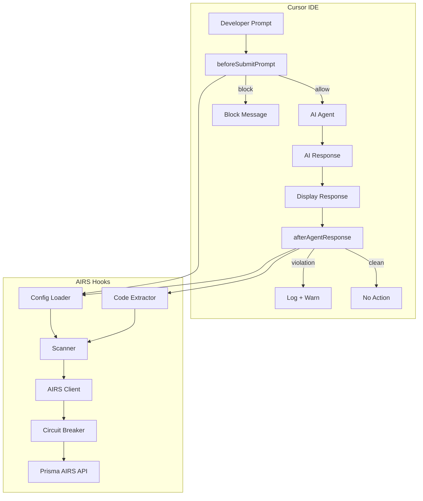

# Architecture Overview

## High-Level Flow

!!! warning "Cursor limitation"
    `afterAgentResponse` is **observe-only**. Cursor displays the AI response before the hook fires — violations are logged and warnings emitted, but the response cannot be blocked or retracted. See [Cursor Limitation](../reference/cursor-hooks-api.md#cursor-limitation-no-response-blocking) for details.

## Module Map

| Module | Purpose |
|--------|---------|
| `src/config.ts` | Load and validate `airs-config.json` with env var resolution |
| `src/airs-client.ts` | SDK wrapper with circuit breaker integration |
| `src/scanner.ts` | Scan orchestration, DLP masking, UX block messages |
| `src/code-extractor.ts` | Extract code blocks from AI responses |
| `src/logger.ts` | Structured JSON Lines logging with rotation |
| `src/circuit-breaker.ts` | Failure tracking, cooldown bypass, automatic recovery |
| `src/dlp-masking.ts` | Per-service enforcement actions (block/mask/allow) |
| `src/log-rotation.ts` | Log file rotation at 10MB threshold |
| `src/types.ts` | TypeScript interfaces for config, Cursor API, AIRS |
| `src/hooks/before-submit-prompt.ts` | Cursor `beforeSubmitPrompt` entry point |
| `src/hooks/after-agent-response.ts` | Cursor `afterAgentResponse` entry point (observe-only) |

## Request Lifecycle

### Prompt Scan (beforeSubmitPrompt)

1. Cursor pipes `{ prompt, user_email, ... }` as JSON to stdin
2. Hook loads config, initializes logger
3. Scanner sends prompt to AIRS via SDK (`prompt` content key)
4. Circuit breaker gates the request (bypass if open)
5. AIRS returns verdict + detections
6. If `enforce` mode and verdict is `block`: output `{ "continue": false, "user_message": "..." }`
7. If `observe` or verdict is `allow`: output `{ "continue": true }`

### Response Scan (afterAgentResponse — observe-only)

1. Cursor pipes `{ text, ... }` as JSON to stdin (**after the response is already displayed**)
2. Hook loads config, initializes logger
3. Code extractor splits response into natural language + code blocks
4. Scanner sends both to AIRS (`response` + `code_response` content keys)
5. `code_response` triggers WildFire/ATP malicious code detection
6. If violation detected: log to audit trail + emit warning (cannot block — observe-only)
7. If clean: output `{ "permission": "allow" }`

## Build Modes

| Mode | Command | Hook Execution | Startup |
|------|---------|---------------|---------|
| Production | `node dist/hooks/*.js` | Precompiled JS | ~800ms |
| Development | `npx tsx src/hooks/*.ts` | JIT TypeScript | ~2.5s |

The `install-hooks` script points at compiled JS by default. See [Contributing](../development/contributing.md) for the development workflow.
