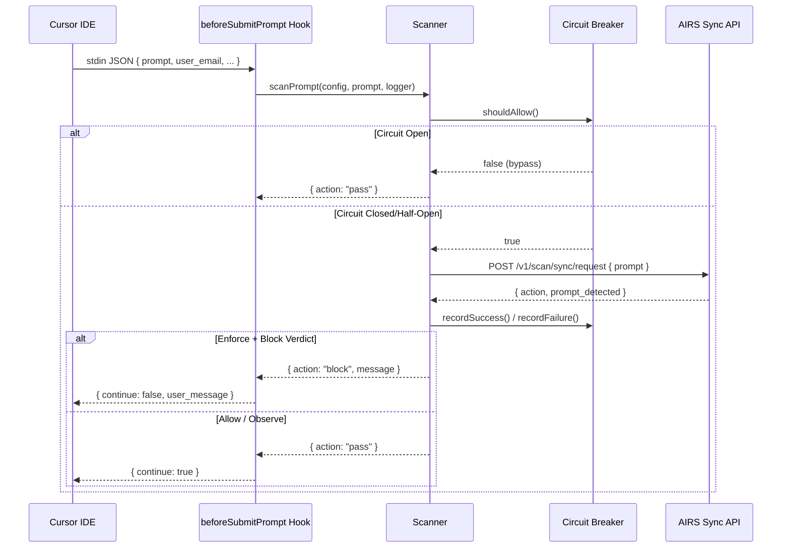
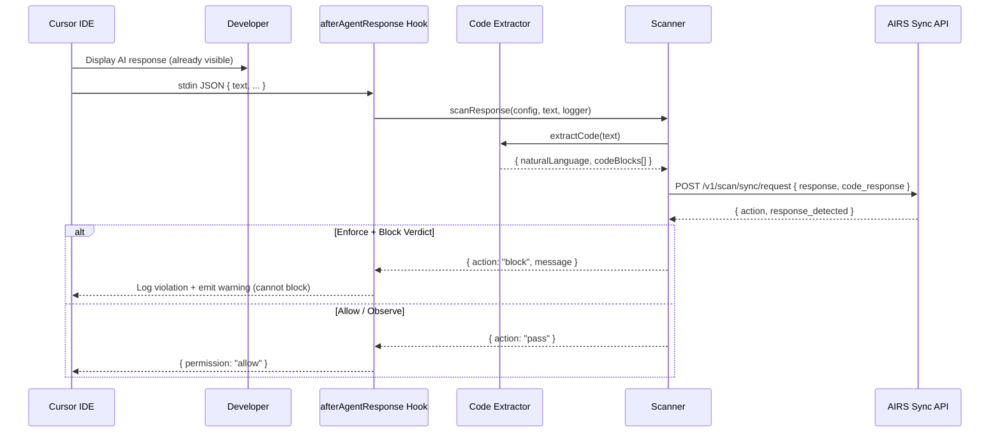
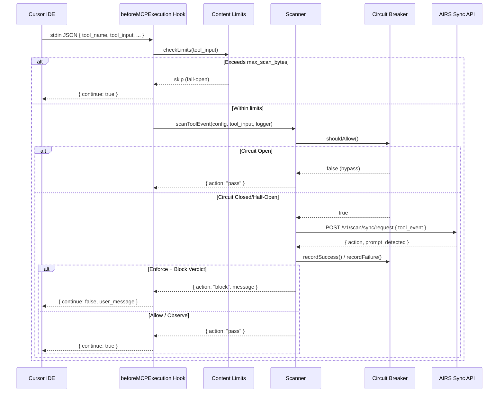
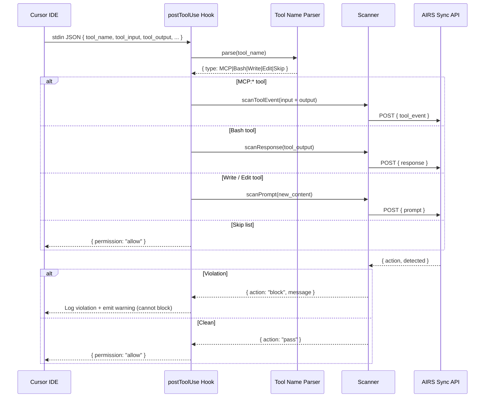

# Scanning Flow

## Prompt Scanning



## Response Scanning (observe-only)

!!! warning "Cursor limitation"
    `afterAgentResponse` is **observe-only** — Cursor displays the AI response before the hook fires. The scan still runs for audit and compliance purposes, but violations cannot block or retract the response.



## Code Extraction Strategy

The code extractor processes AI responses using three strategies in priority order:

1. **Fenced code blocks** -- ` ```language ... ``` ` with language detection
2. **Indented code blocks** -- 4+ leading spaces
3. **Heuristic fallback** -- content matching code indicators (imports, function definitions, braces) above a character threshold

Extracted code is joined with `\n\n---\n\n` separators and sent in the `code_response` field, which triggers WildFire/ATP malicious code scanning on the AIRS side.

## MCP Tool Scanning (beforeMCPExecution — can block)



## Tool Output Scanning (postToolUse — observe-only)

!!! warning "Cursor limitation"
    `postToolUse` is **observe-only** — the tool has already executed before the hook fires. Violations are logged and warnings emitted, but tool output cannot be blocked or retracted.



## Content Splitting

| AIRS Field | Content | Detections |
|-----------|---------|------------|
| `prompt` | User's prompt text or Write/Edit content | Prompt injection, DLP, toxicity, custom topics |
| `response` | Natural language from AI response or Bash output | DLP, toxicity, URL categorization |
| `code_response` | Extracted code blocks from AI response | Malicious code (WildFire/ATP) |
| `tool_event` | MCP tool inputs and outputs | Prompt injection, DLP, malicious parameters |

!!! info "Why split content?"
    Sending code separately in `code_response` enables dedicated malicious code detection engines (WildFire, ATP) that don't run on natural language content. This catches things like reverse shells, credential stealers, and obfuscated payloads in generated code. Similarly, `tool_event` is routed to a security profile tuned for tool-call patterns.
