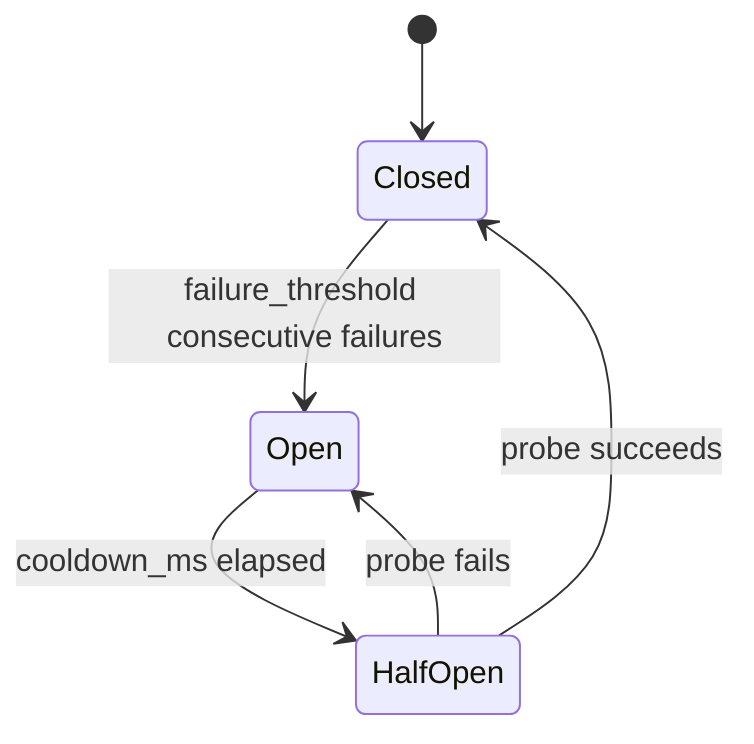

# Circuit Breaker

The circuit breaker prevents cascading failures when the AIRS API is unavailable. After a configurable number of consecutive failures, scanning is temporarily bypassed with automatic recovery.

## States



| State | Behavior |
|-------|----------|
| **Closed** | Normal operation. All requests go to AIRS. Failures increment counter. |
| **Open** | Bypass mode. Returns synthetic allow result without calling AIRS. |
| **Half-Open** | Single probe request sent to AIRS. Success resets to Closed; failure returns to Open. |

## Configuration

```json
{
  "circuit_breaker": {
    "enabled": true,
    "failure_threshold": 5,
    "cooldown_ms": 60000
  }
}
```

| Field | Default | Description |
|-------|---------|-------------|
| `enabled` | `true` | Enable/disable circuit breaker |
| `failure_threshold` | `5` | Consecutive failures before opening circuit |
| `cooldown_ms` | `60000` | Milliseconds before attempting probe (1 minute) |

## Behavior

When the circuit is **open**:

- No AIRS API calls are made
- All prompts/responses pass through (fail-open)
- A log event is recorded: `circuit_breaker_open`
- After `cooldown_ms`, the next request triggers a probe

When the probe **succeeds**:

- Circuit returns to closed
- Normal scanning resumes
- A log event is recorded: `circuit_breaker_closed`

!!! tip "Tuning"
    Set `failure_threshold` based on your tolerance. Lower values (2-3) recover faster from transient issues but may bypass scanning on brief blips. Higher values (10+) are more resilient to flaky networks but take longer to engage bypass mode during real outages.
