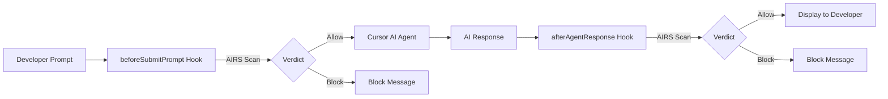

<div class="hero" markdown>

{ .hero-logo }

# Prisma AIRS Cursor Hooks

**Real-time AI security scanning for the Cursor IDE**

[](https://www.npmjs.com/package/@cdot65/prisma-airs-cursor-hooks)
[](https://github.com/cdot65/prisma-airs-cursor-hooks/actions/workflows/ci.yml)
[](https://opensource.org/licenses/MIT)
[](https://nodejs.org/)

</div>

---

Prisma AIRS Cursor Hooks intercepts prompts and AI responses in the Cursor IDE, scanning them in real-time via the [Prisma AI Runtime Security (AIRS)](https://www.paloaltonetworks.com/prisma/ai-runtime-security) Sync API. Detects prompt injections, malicious code, sensitive data leakage, toxic content, and policy violations before they reach the LLM or the developer.

---

## Install

```bash
npm install -g @cdot65/prisma-airs-cursor-hooks
```

---

## How It Works



---

## Capabilities

<div class="grid cards" markdown>

-   :material-shield-search:{ .lg .middle } **Prompt Scanning**

    ---

    Scans every prompt before it reaches the AI agent. Detects prompt injection, DLP violations, toxicity, and custom topic policy violations.

    [:octicons-arrow-right-24: Detection Services](features/detection-services.md)

-   :material-code-braces:{ .lg .middle } **Response & Code Scanning**

    ---

    Parses AI responses to extract code blocks separately. Natural language and code are scanned independently, enabling malicious code detection via WildFire/ATP.

    [:octicons-arrow-right-24: Code Extraction](features/code-extraction.md)

-   :material-shield-lock:{ .lg .middle } **Enforce or Observe**

    ---

    Three modes: `observe` (log only), `enforce` (block on detection), `bypass` (skip). Start in observe mode to audit, switch to enforce when ready.

    [:octicons-arrow-right-24: Configuration](reference/configuration.md)

-   :material-lightning-bolt:{ .lg .middle } **Fail-Open Design**

    ---

    Never blocks the developer on infrastructure failures. Circuit breaker pattern bypasses scanning after consecutive API failures with automatic recovery.

    [:octicons-arrow-right-24: Circuit Breaker](features/circuit-breaker.md)

</div>

---

## Get Started

<div class="grid cards" markdown>

-   :material-download:{ .lg .middle } **Install**

    ---

    Install from npm, set environment variables, and register hooks in Cursor.

    [:octicons-arrow-right-24: Installation](getting-started/installation.md)

-   :material-rocket-launch:{ .lg .middle } **Quick Start**

    ---

    Get scanning in under 5 minutes.

    [:octicons-arrow-right-24: Quick Start](getting-started/quick-start.md)

-   :material-cog:{ .lg .middle } **Configure**

    ---

    Modes, enforcement actions, profiles, circuit breaker, and logging.

    [:octicons-arrow-right-24: Configuration](getting-started/configuration.md)

-   :material-book-open-variant:{ .lg .middle } **Architecture**

    ---

    Scanning flow, module design, and key decisions.

    [:octicons-arrow-right-24: Architecture](architecture/overview.md)

</div>
