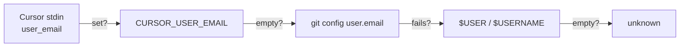

# Environment Variables

## Required

| Variable | Description |
|----------|-------------|
| `AIRS_API_KEY` | Prisma AIRS API key (`x-pan-token`). Used for authentication. |

## Optional

| Variable | Default | Description |
|----------|---------|-------------|
| `AIRS_API_ENDPOINT` | `https://service.api.aisecurity.paloaltonetworks.com` | Regional AIRS API base URL |
| `AIRS_PROMPT_PROFILE` | `cursor-ide-prompt-profile` | Security profile name for prompt scanning |
| `AIRS_RESPONSE_PROFILE` | `cursor-ide-response-profile` | Security profile name for response scanning |

## Cursor-Provided

These are injected by Cursor when running hooks and used internally:

| Variable | Description |
|----------|-------------|
| `CURSOR_PROJECT_DIR` | Absolute path to the current workspace |
| `CURSOR_USER_EMAIL` | Authenticated user's email (if available) |
| `CURSOR_VERSION` | Cursor IDE version string |

## User Identity Resolution

Every AIRS scan includes a `metadata.app_user` field that identifies the developer. This appears as the `user_id` in AIRS scan logs and the Prisma Cloud console, enabling per-user audit trails and policy enforcement.

The identity is resolved using the following fallback chain:



| Priority | Source | Example |
|----------|--------|---------|
| 1 | `user_email` from Cursor hook stdin | `calvin@cdot.io` |
| 2 | `git config user.email` (shell exec) | `calvin@example.com` |
| 3 | `$USER` or `$USERNAME` env var | `cdot` |
| 4 | Hardcoded fallback | `unknown` |

The resolved value is sent to AIRS as:

```json
{
  "metadata": {
    "app_name": "cursor-ide",
    "app_user": "calvin@cdot.io"
  }
}
```

!!! tip "How it works in practice"
    When you're signed into Cursor, it injects your account email into every hook invocation via the `user_email` field in the stdin JSON. Both hooks (`beforeSubmitPrompt` and `afterAgentResponse`) write this to `process.env.CURSOR_USER_EMAIL`, which the scanner then reads as the first-priority identity source.

## Setting Variables

### macOS / Linux (zsh)

```bash
# Add to ~/.zshrc or ~/.zsh.d/20-exports.zsh
export AIRS_API_KEY="your-key-here"
export AIRS_PROMPT_PROFILE="Cursor IDE - Hooks"
export AIRS_RESPONSE_PROFILE="Cursor IDE - Hooks"
```

### macOS / Linux (bash)

```bash
# Add to ~/.bashrc or ~/.bash_profile
export AIRS_API_KEY="your-key-here"
```

!!! info "Cursor inherits your shell environment"
    Cursor loads environment variables from your login shell on macOS. After changing shell exports, **restart Cursor** (not just reload the window) for the changes to take effect.
